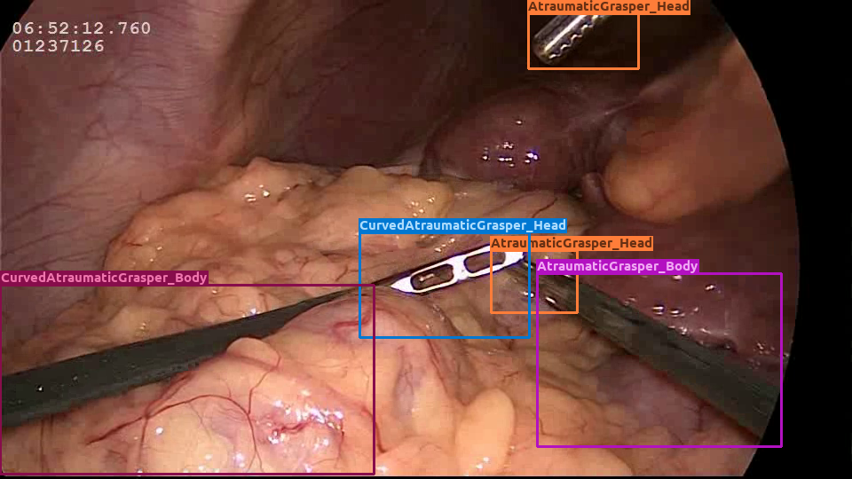
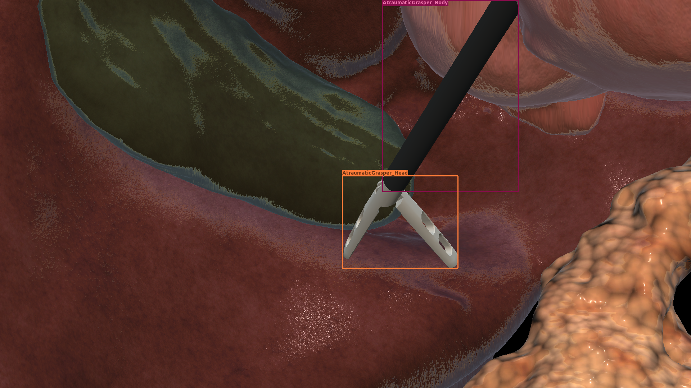
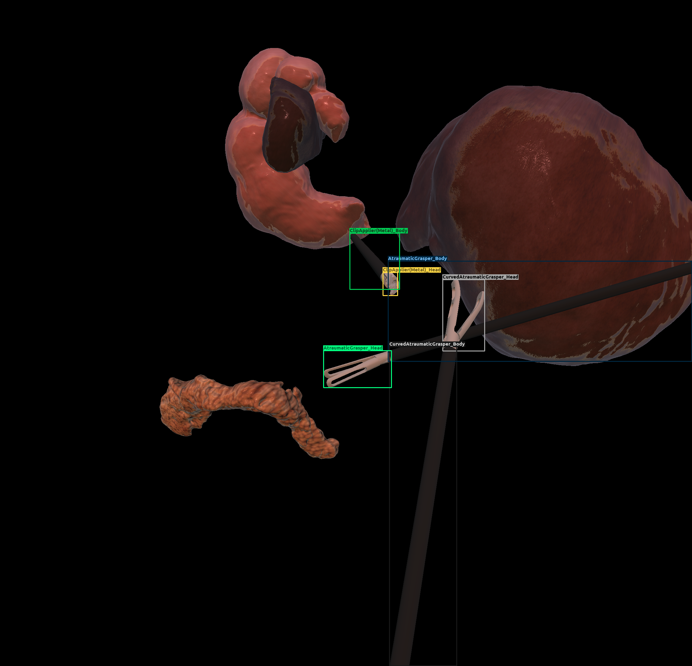
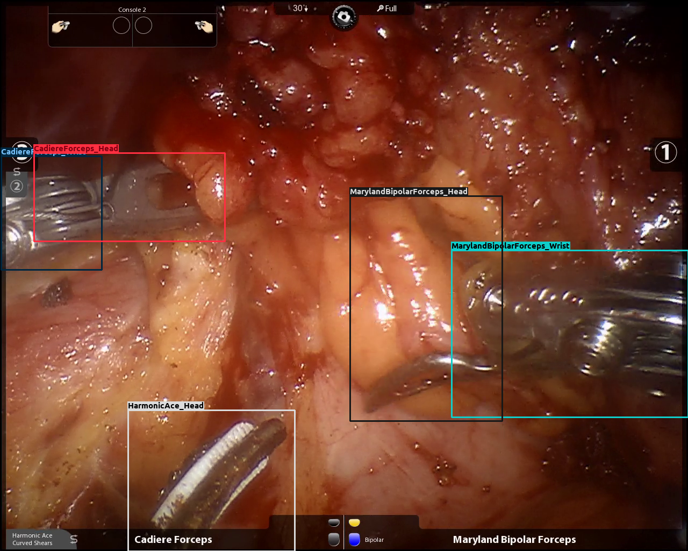
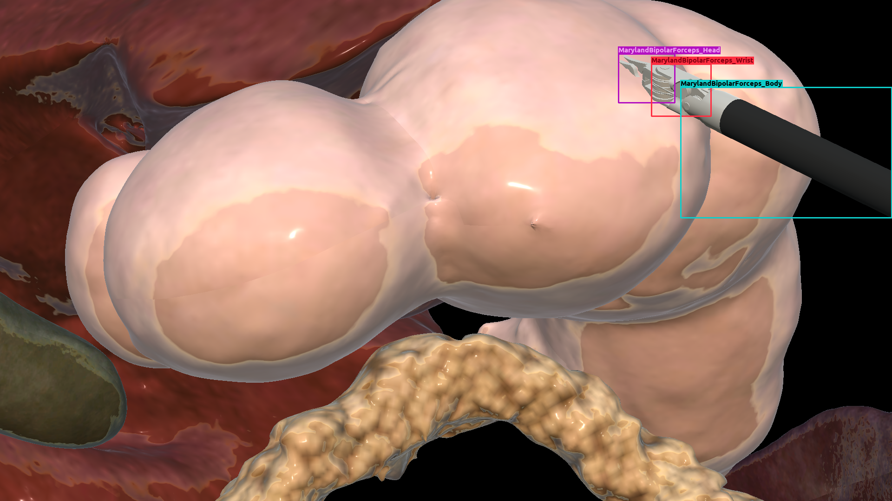
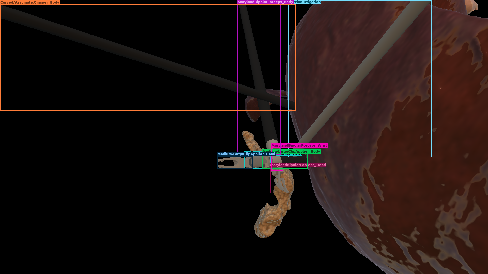
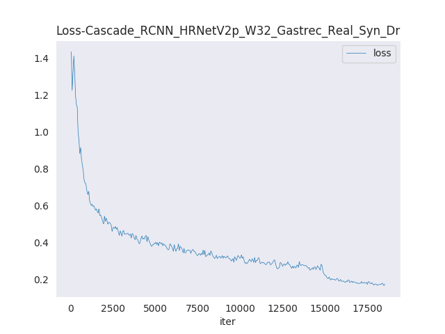
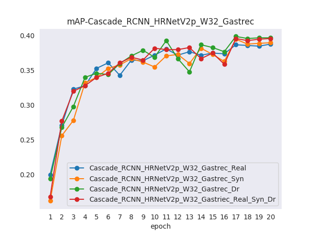
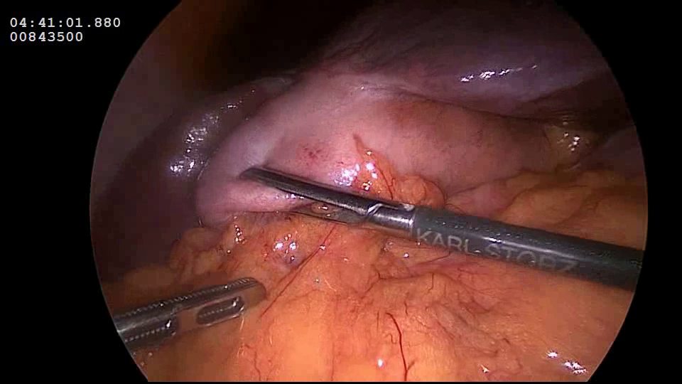
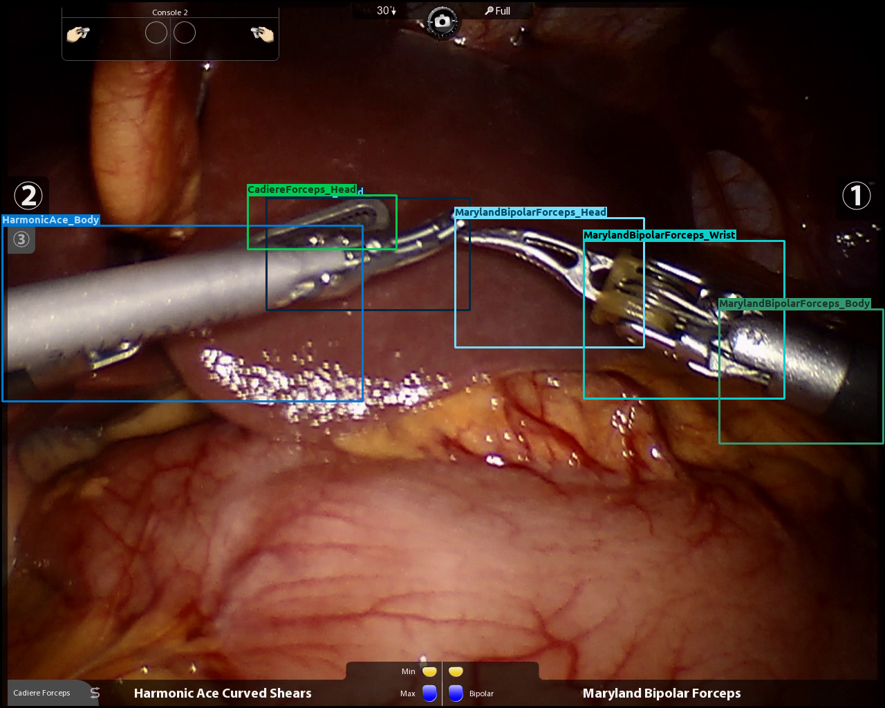

## hSDB-instrument: Instrument Localization Databse for Laparoscopic and Robotic Surgeries (under review)

### What is hSDB-instrument dataset?

hSDB-instrument dataset is a new dataset that reflects the kinematic characteristics of surgical instruments for automated surgical tool recognition of surgical videos. The hSDB-instrument dataset consists of instruments information of cholecystectomy videos obtained from 24 cases of laparoscopic surgery and gastrectomy video obtained from 24 cases of robotic surgery for gastric cancer. Localization information for all tools is provided in the form of a bounding box for training using the object detection framework. At the same time, to handle class imbalance problem between tools, synthetic tools modeled in Unity for three-dimensional (3D) models are included as training data. In addition, we provide object detection models and their baseline performance trained on the hSDB-instrument dataset through MMDetection library. 

### Paper
<iframe src="https://drive.google.com/file/d/1QuKx57oOs0rcsgKf9LSyz28qcO3QssEt/preview" width="840" height="480"></iframe>


### Example Images

| Surgery Type | Data Type            | Image                                     |
| :----------- | :------------------- | :---------------------------------------- |
| Cholec.      | Real                 |    |
| Cholec.      | Synthetic            |      |
| Cholec.      | Domain randomization |        |
| Gastrec.     | Real                 |  |
| Gastrec.     | Synthetic            |    |
| Gastrec.     | Domain randomization |      |


### Dataset

- Download will be available after decision.

| Surgery Type | Data Type                                                    | Comments                                                     |
| :----------- | :----------------------------------------------------------- | :----------------------------------------------------------- |
| Cholec.      | [Real](https://drive.google.com) (deactivate)                | Instrument information for a total of 24 cases of laparoscopic cholecystectomy |
| Cholec.      | [Real<br />+ Synthetic](https://drive.google.com) (deactivate) | Instrument infromation of synthetic tools modeled in Unity for three-dimensional (3D) models generated by user is added to the cholec real dataset |
| Cholec.      | [Real<br />+ Domain randomization](https://drive.google.com) (deactivate) | Instrument infromation of synthetic tools modeled in Unity for three-dimensional (3D) models generated by domain randomization is added to the cholec real dataset |
| Cholec.      | [Real<br />+ Synthetic<br />+ Domain randomization](https://drive.google.com) (deactivate) | All kinds of synthetic dataset are added to the cholec real dataset |
| Gastrec.     | [Real](https://drive.google.com) (deactivate)                | Instrument information for a total of 24 cases of robotic gastrectomy |
| Gastrec.     | [Real<br />+ Synthetic](https://drive.google.com) (deactivate) | Instrument infromation of synthetic tools modeled in Unity for three-dimensional (3D) models generated by user is added to the gastrec real dataset |
| Gastrec.     | [Real<br />+ Domain randomization](https://drive.google.com) (deactivate) | Instrument infromation of synthetic tools modeled in Unity for three-dimensional (3D) models generated by domain randomization is added to the gastrec real dataset |
| Gastrec.     | [Real<br />+ Synthetic<br />+ Domain randomization](https://drive.google.com) (deactivate) | All kinds of synthetic dataset are added to the gastrec real dataset |


### Model Zoo

#### Baselines

More models with different backbones will be added to the model zoo (scroll right following table to download models).

| Surgery type | Model         | Bacbone      | Sub-module        | Dataset                                           | Epoch | mAP  | Download                                                     |
| :----------- | :------------ | :----------- | :---------------- | :------------------------------------------------ | :---- | :--- | ------------------------------------------------------------ |
| Cholec.      | Cascade R-CNN | HRNetV2p-W32 | -                 | Real                                              | 20    | 25.7 | [Download](https://drive.google.com/drive/folders/1FIeJUjgpLIy1IHWOj4iyMd9-9htzWmvu?usp=sharing) |
| Cholec.      | Cascade R-CNN | HRNetV2p-W32 | -                 | Real<br />+ Synthetic                             | 20    | 25.2 | [Download](https://drive.google.com/drive/folders/1xpMbvSPGOeDfLKaT5nBGaQOJ3lmudzeL?usp=sharing) |
| Cholec.      | Cascade R-CNN | HRNetV2p-W32 | -                 | Real<br />+ Domain randomization                  | 20    | 25.8 | [Download](https://drive.google.com/drive/folders/18hRQab7iFRoXEkNVUg5F56q_osF3Mtzh?usp=sharing) |
| Cholec.      | Cascade R-CNN | HRNetV2p-W32 | -                 | Real<br />+ Synthetic<br />+ Domain randomization | 20    | 27.1 | [Download](https://drive.google.com/drive/folders/1Coruxj39NWt2mF6ivfmPPlRZh5S-51MM?usp=sharing) |
| Cholec.      | FoveaBox      | ResNet101    | FPN + align-gn-ms | Real                                              | 12    | 23.7 | [Download](https://drive.google.com/drive/folders/1AR-9ceXfUj-UB-GPIDkv930S_LU5L25M?usp=sharing) |
| Cholec.      | FoveaBox      | ResNet101    | FPN + align-gn-ms | Real<br />+ Synthetic                             | 12    | 26.2 | [Download](https://drive.google.com/drive/folders/1RyCPB0mXoCrHR8NTAVniJS8xCWp-acin?usp=sharing) |
| Cholec.      | FoveaBox      | ResNet101    | FPN + align-gn-ms | Real<br />+ Domain randomization                  | 12    | 25.1 | [Download](https://drive.google.com/drive/folders/1Ed0DPfvMPnN05PHi7DX-yijqRZ3LJ5M9?usp=sharing) |
| Cholec.      | FoveaBox      | ResNet101    | FPN + align-gn-ms | Real<br />+ Synthetic<br />+ Domain randomization | 12    | 26.4 | [Download](https://drive.google.com/drive/folders/1z-qan-EsKZ8WtHhmtVdd9zWr5KyUUJ6S?usp=sharing) |
| Gastrec.     | Cascade R-CNN | HRNetV2p-W32 | -                 | Real                                              | 20    | 38.8 | [Download](https://drive.google.com/drive/folders/1vyiYUcmV-oX5pAjAsHW2CTfX2miICgwn?usp=sharing) |
| Gastrec.     | Cascade R-CNN | HRNetV2p-W32 | -                 | Real<br />+ Synthetic                             | 20    | 39.8 | [Download](https://drive.google.com/drive/folders/1w1n519M-2ePtYQUAXIOqxwHZIy-yclOy?usp=sharing) |
| Gastrec.     | Cascade R-CNN | HRNetV2p-W32 | -                 | Real<br />+ Domain randomization                  | 20    | 39.7 | [Download](https://drive.google.com/drive/folders/1XfVhCQrDZPKJOeLH6i64wGnHMZzuGhUi?usp=sharing) |
| Gastrec.     | Cascade R-CNN | HRNetV2p-W32 | -                 | Real<br />+ Synthetic<br />+ Domain randomization | 20    | 39.6 | [Download](https://drive.google.com/drive/folders/1sLeQJnqeWGyCi-qHAgRVVKf5fBInm3Ep?usp=sharing) |
| Gastrec.     | FoveaBox      | ResNet101    | FPN + align-gn-ms | Real                                              | 12    | 37.5 | [Download](https://drive.google.com/drive/folders/1NCu-gQAn7tbL2AUotCsAPRi39rcwJFAJ?usp=sharing) |
| Gastrec.     | FoveaBox      | ResNet101    | FPN + align-gn-ms | Real<br />+ Synthetic                             | 12    | 37.9 | [Download](https://drive.google.com/drive/folders/1nCJBSPoRYIpEzizNKOxCxo6VpVKEfAOK?usp=sharing) |
| Gastrec.     | FoveaBox      | ResNet101    | FPN + align-gn-ms | Real<br />+ Domain randomization                  | 12    | 38.6 | [Download](https://drive.google.com/drive/folders/1ZIeVblvaLb5AgQtpl7-566yXUo4L_0OM?usp=sharing) |
| Gastrec.     | FoveaBox      | ResNet101    | FPN + align-gn-ms | Real<br />+ Synthetic<br />+ Domain randomization | 12    | 40.7 | [Download](https://drive.google.com/drive/folders/1XEAiGoyVVPcaHGdO8fOQPzclPzgujHaA?usp=sharing) |


#### Loss and mAP

- Learning curve according to Cascade R-CNN HRNetV2p-W32 in training using gastrec(real + synthetic + domain randomization) dataset



- Learning performance curves according to Cascade R-CNN HRNetV2p-W32 in training using hSDB-instrument gastrec dataset




### Test baseline models

#### Installation 

##### Requirements

- Linux (Windows is not officially supported)
- Python 3.5+
- PyTorch 1.1 or higher
- CUDA 9.0 or higher
- NCCL 2
- GCC 4.9 or higher
- [mmcv](https://github.com/open-mmlab/mmcv)


##### Install mmdetection

We used MMdetection library(v1.1.0) to train object detection models on the hSDB-instrument dataset. Following instruction is based on the official MMdetection documentation.

1. Create a conda virutal environment and activate it.

   ```bash
   conda create -n open-mmlab python=3.7 -y
   conda activate open-mmlab
   ```

2. Install Pytorch and torchvision follwoing the official instructions, e.g.,

   ```bash
   conda install pytorch torchvision cudatoolkit=10.1 -c pytorch
   ```

3. Clone the hsdb-instrument detection repository

   ```bash
   git clone https://github.com/hsdb-instrument/hsdb-mmdetection.git
   cd hsdb-mmdetection
   ```

4. Install build requirements and then install hsdb-instrument mmdetection. (We install pycocotools via the github repo instead of pypi because the pypi version is old and not compatible with the latest bumpy.)

   ```bash
   pip install -r requirements/build.txt
   pip install "git+https://github.com/cocodataset/cocoapi.git#subdirectory=PythonAPI"
   pip install -v -e .  # or "python setup.py develop"
   ```

Note:

1. The git commit id will be written to the version number with step d, e.g. 0.6.0+2e7045c. The version will also be saved in trained models. It is recommended that you run step d each time you pull some updates from github. If C++/CUDA codes are modified, then this step is compulsory.
2. Following the above instructions, mmdetection is installed on `dev` mode, any local modifications made to the code will take effect without the need to reinstall it (unless you submit some commits and want to update the version number).
3. If you would like to use `opencv-python-headless` instead of `opencv-python`, you can install it before installing MMCV.
4. Some dependencies are optional. Simply running `pip install -v -e .` will only install the minimum runtime requirements. To use optional dependencies like `albumentations` and `imagecorruptions` either install them manually with `pip install -r requirements/optional.txt`or specify desired extras when calling `pip` (e.g. `pip install -v -e .[optional]`). Valid keys for the extras field are: `all`, `tests`, `build`, and `optional`.


#### Inference with pretrained models

We provide testing scripts to inference sample images.

You can use the following commands to test sample images.

```bash
./hsdb_demo/demo_inference.sh ${CONFIG} ${CHECKPOINT} ${FRAME_IN_DIR} ${FRAME_OUT_DIR} [--score_thr ${SCORE_THRESHOLD}] [--cholec]
```

Optional arguments:

-  `SCORE_THRESHOLD`: Score threshold value of object detection class probablity. If not specified, the value will be 0.5 as default.
- `--cholec`: If specified, it is assumed that detection model and input images will be of cholecystectomy. If not, gastrectomy.


Examples:

Assume that you have already downloaded the checkpoint and config file to the directory `hsdb_demo/checkpoints_configs/`.

1. Test Cascade R-CNN HRNetV2p-W32 and cholecytectomy dataset.

   ```bash
   ./hsdb_demo/demo_infernce.sh --cholec
   ```

2. Test Cascade R-CNN HRNetV2p-W32 with 0.7 threshold and gastrectomy dataset.

   ```bash
   ./hsdb_demo/demo_inference.sh --score_thr 0.7
   ```

   

#### Sample Images

More samples are included in `hsdb_demo/sample_images/`.

#### Laproscopic Cholecystectomy




#### Robotic Gastrectomy




